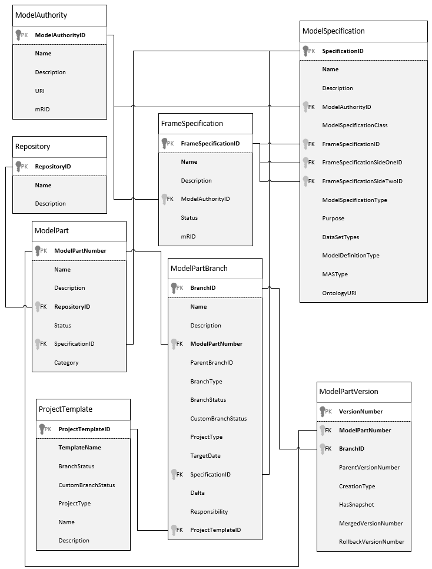

Version Control and Related Metadata Entities
---------------------------------------------

Repository
~~~~~~~~~~
The repository (:ref:`repository`) is a group of model parts which are used together. Shortly the repository is a logical container of its model parts. 

Model Part
~~~~~~~~~~
The model part (:ref:`modelpart`) represents single network model regardless how big or small it is. 

Branch
~~~~~~~~~~
The branch (or more precisely model part branch) is an independent line of development (variation of model part). Branching means you diverge from the main line of model part and continue to do work without messing with that main line. 

Version
~~~~~~~~~~
The version (or more precisely model part version) represents the state of the model part in given point of time.

The Entity Relationship Diagram
~~~~~~~~~~~~~~~~~~~~~~~~~~~~~~~

.. _repository:

Repository Entity
-----------------

This is the repository entity description.

.. _modelpart:

Model Part Entity
-----------------

This is the model part entity description.
